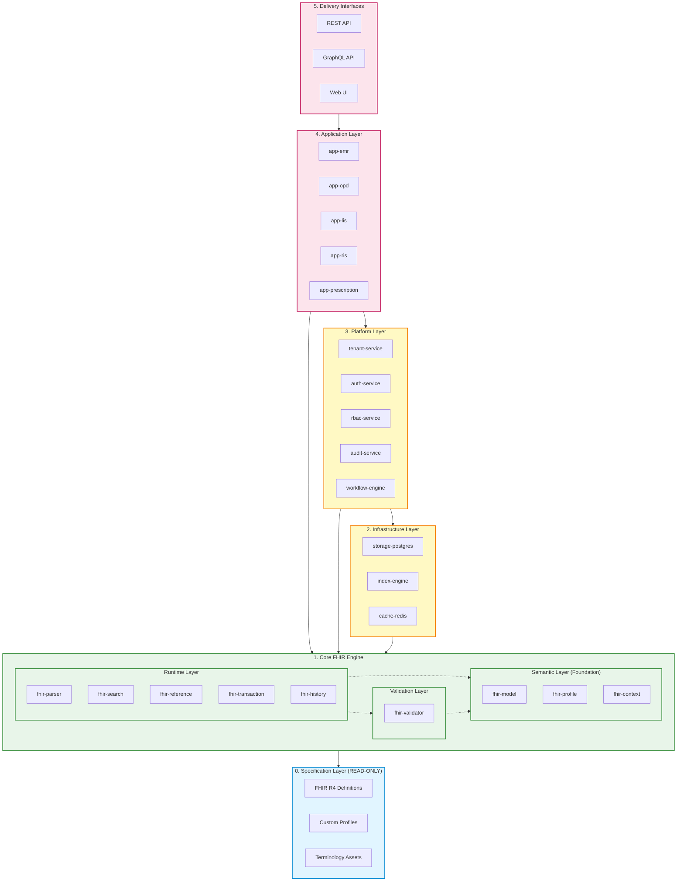
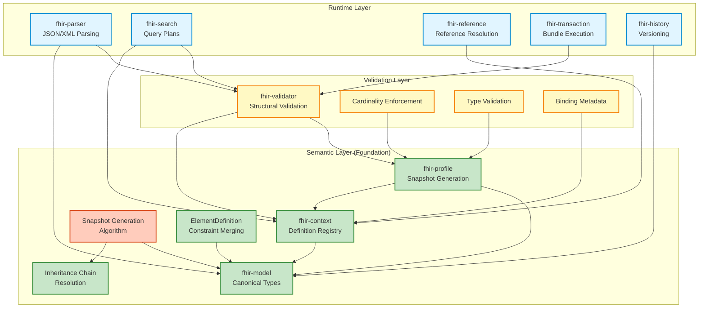

# System Architecture (Enforceable)

> **Status:** Active
> **Version:** v1.1 (Enforceable)
> **Last Updated:** 2026-02-03

This document defines **binding architectural rules** for the system.
Any new module, feature, or refactor **MUST comply** with this document.
Violations require an Architecture Decision Record (ADR) and explicit approval.

---

## 1. Architectural Goals (MUST)

The system **MUST**:

1. Provide a **FHIR-first** core platform implemented in **Node.js + TypeScript**.
2. Fully support **Chinese healthcare semantics and workflows** as first-class concerns.
3. Enable **end-to-end control** from FHIR parsing → persistence → application usage.
4. Serve as a **long-term extensible foundation**, not a one-off application.
5. Support **multi-tenant hospital-grade deployments** (medium-scale hospitals).

### 1.1 Phase-1 Core Goal (ENFORCED)

Phase-1 development **MUST focus on**:

- Correct FHIR parsing and internal representation
- Deterministic validation and search behavior
- Stable persistence and indexing model
- Clean module boundaries

Phase-1 **MUST NOT** prioritize:

- Performance optimization
- Full clinical feature completeness
- AI-driven medical decision logic

---

## 2. Non-Goals (MUST NOT)

The system **MUST NOT**:

1. Attempt to replicate a full HIS / EHR / LIS product suite in early stages.
2. Embed hospital-specific business logic into core FHIR layers.
3. Depend directly on UI frameworks or frontend state.
4. Hard-code vendor, hospital, or region-specific rules into the core.
5. Allow AI systems to mutate data without deterministic validation.

---

## 3. Layered Architecture (ENFORCED)

The system **MUST** follow this layered model.
Dependencies are **strictly one-directional**.

### 3.0 System Layering Diagram



**Legend:**

- **Solid arrows (→)**: Layer dependencies (must flow downward only)
- **Dashed arrows (-.->)**: Internal sublayer dependencies within Core FHIR Engine
- **Colors**:
  - 🔵 Blue: Read-only (Specification)
  - 🟢 Green: Very High Stability (Core FHIR)
  - 🟡 Yellow: Medium Stability (Infrastructure, Platform)
  - 🔴 Pink: Low Stability / High Evolvability (Application, Delivery)

**Text Representation:**

```
Specification
    ↓
Core FHIR Engine
    ↓
Infrastructure Services
    ↓
Application Modules
    ↓
Delivery Interfaces
```

### 3.1 Specification Layer (READ-ONLY)

**Responsibilities:**

- External FHIR definitions (R4/R5)
- Profiles and Extensions
- Terminology assets (e.g. fhir-cn-terminology-assets)

**Rules:**

- MUST be treated as immutable inputs
- MUST NOT contain executable business logic
- MUST NOT depend on any internal module

---

### 3.2 Core FHIR Engine (MOST STABLE)

The Core FHIR Engine is subdivided into three sublayers with strict dependencies:

#### Core FHIR Engine Internal Architecture



**Key Dependency Rules:**

- Runtime Layer → Validation Layer → Semantic Layer (strict downward flow)
- Semantic Layer MUST NOT depend on Validation or Runtime
- All layers depend on `fhir-model` for type definitions

#### 3.2.1 Semantic Layer (Foundation)

**Responsibilities:**

- StructureDefinition canonical interpretation
- **Snapshot generation from differential** (HAPI core algorithm)
- **Profile inheritance chain resolution**
- ElementDefinition constraint merging (cardinality, type, binding)
- Slicing definition processing
- Type system and cardinality rules
- Path normalization (base, sliced, choice types)

**Key Modules:** `fhir-model`, `fhir-profile`, `fhir-context`

**Rules:**

- MUST be deterministic (same input → same output)
- MUST NOT depend on Validation or Runtime layers
- MUST NOT access external resources (database, HTTP)

---

#### 3.2.2 Validation Layer

**Responsibilities:**

- Structural validation against profiles
- Cardinality enforcement (min/max)
- Type constraint checking
- Required element presence validation
- Terminology binding hooks (metadata only, no expansion)

**Key Modules:** `fhir-validator`

**Depends on:** Semantic Layer only

**Rules:**

- MUST use resolved snapshots from Semantic Layer
- MUST NOT evaluate FHIRPath constraints (deferred to Stage-3)
- MUST NOT perform terminology expansion (deferred to Infrastructure)
- MUST NOT validate reference targets at runtime (deferred to Stage-3)

---

#### 3.2.3 Runtime Layer

**Responsibilities:**

- FHIR resource parsing (JSON/XML → runtime objects)
- Reference resolution (logical → literal)
- Search grammar interpretation
- Versioning & history semantics
- Transaction bundle execution

**Key Modules:** `fhir-parser`, `fhir-search`, `fhir-reference`, `fhir-transaction`, `fhir-history`

**Depends on:** Semantic Layer and Validation Layer

**Rules:**

- MUST validate through Validation Layer before persistence
- MUST use canonical semantics from Semantic Layer

---

**Cross-Layer Rules:**

- Semantic Layer MUST NOT depend on Validation or Runtime layers
- Validation Layer MUST NOT depend on Runtime layer
- Runtime Layer MAY depend on both Semantic and Validation layers
- All layers MUST be framework-agnostic
- All layers MUST NOT reference application concepts (patients, orders, billing)
- All layers MUST expose only typed interfaces
- All layers MUST remain backward compatible within a major version

This layer is conceptually inspired by **HAPI FHIR**, but implemented independently in TypeScript.

---

### 3.3 Infrastructure Services

**Responsibilities:**

- Persistence (PostgreSQL + JSONB)
- Indexing strategy
- Transaction boundaries
- Audit logging
- Authorization primitives (Auth, Tenant, RBAC)

**Rules:**

- MUST NOT reinterpret FHIR semantics
- MUST NOT embed workflow logic
- MAY be replaced without affecting Core FHIR Engine

---

### 3.4 Application Modules (PLUGGABLE)

**Responsibilities:**

- EMR
- Outpatient management
- Lab (LIS)
- Imaging (RIS)
- Prescription & approval workflows

**Rules:**

- MUST depend on Core FHIR Engine interfaces
- MUST NOT bypass validation or search engines
- MUST express rules via workflows, not hard-coded branches
- MUST be tenant-aware

---

### 3.5 Delivery Interfaces

**Responsibilities:**

- REST APIs
- Admin UI (via prismui)
- Integration adapters

**Rules:**

- MUST NOT contain business logic
- MUST NOT access persistence directly
- MUST act as thin orchestration layers only

---

## 4. Module Responsibility Contract (STRICT)

Every module **MUST** declare:

- Its layer
- Its allowed dependencies
- Its forbidden dependencies

A module **MUST NOT**:

- Call across layers
- Import internal symbols from sibling modules
- Mutate data it does not own

---

## 5. Design Principles (BINDING)

All implementation **MUST** adhere to:

1. **FHIR-first** – FHIR is the source of truth
2. **Schema-driven** – behavior follows structure
3. **Explicit over implicit** – no magic behavior
4. **Human-led AI** – AI assists, never decides
5. **Chinese healthcare as default** – not a localization layer

---

## 6. Extension Points (CONTROLLED)

Allowed extension mechanisms:

- FHIR Profiles & Extensions
- Module registration
- Workflow definitions
- Terminology assets

Disallowed:

- Monkey-patching core engine
- Overriding validation rules in applications
- Direct DB schema manipulation by applications

---

## 7. Stability Policy

| Area                 | Stability |
| -------------------- | --------- |
| Core abstractions    | Very High |
| Search semantics     | High      |
| Persistence adapters | Medium    |
| Application modules  | Low       |
| UI                   | Very Low  |

Breaking changes **MUST**:

- Be documented via ADR
- Include migration strategy

---

## 8. Enforcement Rules

1. New modules **MUST reference this document** in their README.
2. Code reviews **MUST block** violations.
3. CI **SHOULD** include architecture boundary checks.
4. Disputes are resolved via ADRs, not exceptions.

---

## 9. Development Stages (Enforced)

Stages define **time-bounded capability constraints** over this architecture.

A Stage:

- DOES NOT introduce new architectural concepts
- DOES NOT change layer responsibilities
- ONLY restricts which modules and dataflows are legally instantiable at a given time

At any given Stage:

- Modules not explicitly allowed MUST NOT exist
- Dataflows not explicitly allowed MUST NOT be implemented

Stage definitions are binding and enforceable.

---

## 10. Relationship to Other Documents

- MODULES.md defines concrete module inventory
- DATAFLOW.md defines runtime behavior
- ADRs document deviations or evolution

This document is the **highest authority** on system structure.
